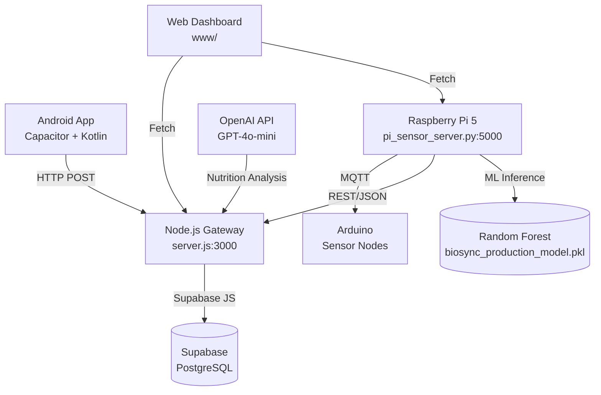
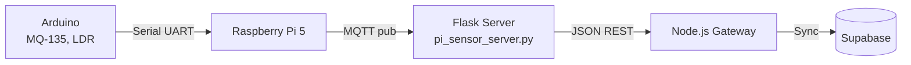

# BioSync

A privacy-focused integrated health intelligence platform that correlates 
physiological markers with indoor environmental conditions to calculate a 
real-time Vitality Index using machine learning.

**Team:**
- [Mohammad Suhayl](https://github.com/suhayl05) — Hardware Engineer, Sensor Calibration  
- [Abdul Rahman](https://github.com/Abdxlrahman) — Data Scientist, ML Model Optimisation  
- [Nabeel Syed](https://github.com/nabeelsyed14) — Full-Stack Developer, Native Android Bridge

---

## Problem Statement

Health monitoring is typically fragmented across multiple disconnected apps — 
wearable data in one place, nutrition logging elsewhere, environmental factors 
ignored entirely. Cloud sync of sensitive health data raises privacy concerns. 
BioSync addresses this by:

1. Integrating directly with Health Connect for on-device biometric reading
2. Supplementing with Raspberry Pi environmental sensors (CO2, temperature, humidity)
3. Calculating a standardised Vitality Index via a custom ML model
4. Storing all data in Supabase (user-controlled PostgreSQL)

## System Overview

BioSync operates across three layers:

**Mobile App:** A Capacitor-based Android app with a custom Kotlin plugin 
(`BioSyncHealthPlugin.kt`) that reads Steps, Heart Rate, Sleep, SpO2, and HRV 
directly from Health Connect. No cloud dependency for biometric data.

**IoT Gateway:** A Python Flask server (`pi_sensor_server.py`) running on 
Raspberry Pi 5, receiving sensor data via MQTT from Arduino sensor nodes and 
the Pi's local sensor array. Serves environmental telemetry and exposes an ML 
inference endpoint (`/predict`).

**Dashboard:** A web SPA (`www/`) displaying aggregated health metrics, 
environmental data, and the ML-calculated Vitality Index. Communicates with 
both the Node.js gateway (`server.js`) for health and nutrition data, and the 
Pi's Flask server for environmental data.

## Architecture



## Hardware-Software Interaction



## Technical Stack

| Layer | Technology | Rationale |
|---|---|---|
| Mobile | Capacitor 8 + Kotlin | Cross-platform from web code, native Health Connect access |
| Health Bridge | Custom BioSyncHealthPlugin.kt | Replaced buggy @capgo/capacitor-health; crash-safe exception handling |
| IoT Gateway | Python Flask + paho-mqtt | Sensor library availability, lightweight HTTP + MQTT |
| Backend | Node.js + Express | Familiar runtime, JSON APIs |
| Database | Supabase PostgreSQL | RLS policies, realtime subscriptions |
| ML | scikit-learn RandomForestRegressor | Ensemble method, serialised to joblib |
| AI Vision | GPT-4o-mini | Cost-effective image analysis for nutrition |
| Frontend | Vanilla JS + CSS | No build step required |
| Hardware | Arduino Nano + MQ-135 + LDR | Low-cost air quality sensing |

## Key Engineering Features

**Custom Health Connect Plugin:** The official `@capgo/capacitor-health` plugin 
caused JVM crashes on certain Android versions and Xiaomi/MI Band devices. 
BioSync uses a custom Kotlin plugin that wraps Health Connect SDK calls with 
comprehensive try-catch exception handling. Each metric (steps, HR, sleep, SpO2, 
HRV) is fetched independently — if one permission fails, the others still return.

**MQTT-to-HTTP Bridge:** The Raspberry Pi runs an MQTT broker for low-latency 
sensor communication from Arduino nodes. The Flask server bridges MQTT messages 
to REST endpoints, allowing the Node.js gateway to poll environmental data 
without maintaining a persistent MQTT connection.

**On-Device ML Inference:** The ML model runs on the Pi via the Flask `/predict` 
endpoint to minimise latency for local environmental data. The Pi loads the 
serialised RandomForest and scaler at startup, performing inference without 
round-tripping to a cloud service.

**Google Fit OAuth Fallback:** The Node.js gateway supports Google Fit OAuth for 
cloud-based health data sync on devices without Health Connect, providing 
backwards compatibility for older Android devices.

**Nutrition Analysis Pipeline:** Meal photos are base64-encoded and sent to the 
Node.js gateway, which forwards to GPT-4o-mini with a strict JSON output prompt. 
The response is parsed and scored against user goals (lose/maintain/gain/muscle).

**Serial Buffer Management:** Arduino's 9600 baud serial output can buffer stale 
data. The Pi discards the entire serial buffer before each read to ensure only 
the freshest sensor reading is processed.

## Machine Learning

> **Note:** The model was trained on 5,000 synthetically generated observations 
> using a weighted formula as ground truth. Reported metrics reflect how well the 
> model replicates that formula — not clinical prediction accuracy. Real-world 
> performance will differ until retrained on actual user data.

**Dataset:** 5,000 synthetic observations generated by `generate_raw_data.py`

**Features (9 total):**

| Feature | Range |
|---|---|
| user_age | 18–65 |
| steps_taken | 0–35,000 |
| sleep_hours_tracked | 0–14h |
| avg_resting_hr | 40–180 bpm |
| calories_consumed | — |
| protein_intake_g | — |
| room_temp_c | — |
| room_co2_ppm | — |
| spo2_percentage | — |

**Target:** `readiness_score` (0–100), generated via weighted formula combining 
sleep quality, activity level, cardiovascular efficiency, and environmental comfort.

**Data remediation:** Median imputation for missing values; outlier clipping for 
physically impossible readings (HR > 180, sleep > 14h).

**Train/Test split:** 80/20, random_state=42. Features standardised via 
StandardScaler before model input.

**Final model:** RandomForestRegressor(n_estimators=100, random_state=42)  
Selected after comparing Linear Regression, Decision Tree, Random Forest, and 
Gradient Boosting on holdout RMSE and R². Full comparison in `ML/Biosync_ML.ipynb`.

**Serialisation:** Model and scaler saved as `biosync_production_model.pkl` and 
`biosync_scaler.pkl` via joblib. Loaded at Flask server startup.

## Hardware

**Raspberry Pi 5:** Runs `pi_sensor_server.py` (Flask) and hosts the MQTT broker.

**Arduino Nano + MQ-135 + LDR:** Secondary sensor node for air quality monitoring. 
Reads analog values from MQ-135 (air quality proxy) and LDR (light level), 
publishes via Serial at 9600 baud.

> Note: MQ-135 provides an air quality proxy, not calibrated CO2 ppm. LDR 
> provides relative light level, not lux. Readings are indicative, not precise.

**DHT22:** Temperature and humidity sensor connected to the Pi.

**Communication:** MQTT (paho-mqtt) for sensor-to-Pi; HTTP/JSON for Pi-to-gateway.

## Installation & Setup

**Prerequisites**
- Node.js 18+
- Python 3.10+
- Supabase project
- OpenAI API key
- Android Studio (for mobile build)
- Raspberry Pi 5 + Arduino Nano (for full IoT mode)

**Backend (Node.js Gateway)**
```bash
npm install
node server.js
```

**IoT Server (Raspberry Pi)**
```bash
pip install -r requirements.txt
python pi_sensor_server.py
```

**Environment Variables (`.env`)**
```
OPENAI_API_KEY=sk-...
SUPABASE_URL=https://your-project.supabase.co
SUPABASE_ANON_KEY=your-anon-key
GOOGLE_FIT_CLIENT_ID=your-client-id
GOOGLE_FIT_CLIENT_SECRET=your-client-secret
GOOGLE_FIT_REDIRECT_URI=http://localhost:3000/auth/google/callback
PORT=3000
```

**Mobile Build**
```bash
npx cap sync android
npx cap open android
```

## Project Structure

```
biosync/
├── server.js                  # Node.js Express gateway (port 3000)
├── run.py                     # Launcher + health check utility
├── pi_sensor_server.py        # Flask IoT gateway (port 5000)
├── requirements.txt           # Python dependencies
├── package.json
├── capacitor.config.json
├── .env.example
├── www/                       # Web dashboard SPA
│   ├── index.html
│   └── js/
│       ├── app.js             # Main UI logic
│       ├── config.js          # Supabase config
│       ├── sync-engine.js     # Cloud sync
│       ├── gamification.js    # XP, goals, badges
│       └── audio-engine.js    # Web Audio chimes
├── android/
│   └── app/src/main/java/com/biosync/v2/
│       ├── BioSyncHealthPlugin.kt   # Health Connect bridge
│       └── MainActivity.java
├── ML/
│   ├── Biosync_ML.ipynb           # Research notebook
│   ├── train_model.py             # Training script
│   ├── generate_raw_data.py       # Synthetic data generator
│   ├── biosync_production_model.pkl
│   ├── biosync_scaler.pkl
│   └── biosync_raw_hardware_data.csv
└── biosync_arduino/
    └── biosync_arduino.ino        # Arduino firmware for MQ-135 + LDR
```

## Technical Challenges & Solutions

**JVM crashes from third-party Capacitor plugin:** The `@capgo/capacitor-health` 
plugin crashed because it did not handle `SecurityException` when permissions 
were not granted. The replacement custom Kotlin plugin catches all exceptions at 
every layer — each metric fetch is independently wrapped, and the top-level 
Coroutine scope has its own try-catch. One failing permission no longer blocks 
other metrics from returning.

**MQTT reliability under WiFi drops:** The Flask server subscribes to the MQTT 
topic and maintains an in-memory `latest_data` dict. The Node.js gateway polls 
the Flask server via HTTP rather than maintaining its own MQTT connection. The 
broker queues messages; on Pi restart, it republishes the latest reading on 
reconnect.

**Stale serial buffer data from Arduino:** Arduino's serial buffer can accumulate 
readings between poll intervals. The Pi discards the entire buffer before each 
read, ensuring only the most recent sensor value is processed. Data is published 
to MQTT at a fixed 30-second interval regardless of value changes, maintaining 
a heartbeat.

**ML model boot time on Pi:** Loading the RandomForest and StandardScaler at 
startup adds approximately 2 seconds to boot time. Addressed by running the 
Flask server as a background service that auto-restarts, so the load penalty 
occurs once at system startup rather than per-request.

## Known Limitations

- **Synthetic ML training data:** Model trained on 5,000 synthetic observations. 
  Real-world health correlations may differ significantly from reported metrics.
- **Approximate sensors:** MQ-135 provides an air quality proxy, not calibrated 
  CO2. LDR provides relative light level, not lux.
- **No offline-first architecture:** The web dashboard requires connectivity to 
  both the Node.js gateway and Pi server.
- **Single-user focus:** No multi-user support; all health metrics are attributed 
  to one profile.

## Future Improvements

- Retrain model on anonymised real user data with consent
- Track predicted Vitality Index vs user-reported energy levels to measure 
  calibration drift
- Add SpO2 as an ML feature (currently read by the app but not used in the model)
- Integrate Pi Camera for local meal photo capture, removing the base64-to-OpenAI 
  round trip

## Lessons Learned

Building a custom Capacitor plugin taught the team that wrapping native SDKs 
requires exhaustive error handling at every layer. The `@capgo/capacitor-health` 
plugin crashed because it didn't handle `SecurityException` when permissions 
weren't granted. The replacement catches all exceptions independently per metric, 
preventing one failure from cascading.

Running ML inference on the Pi rather than in the cloud required careful 
consideration of startup time and memory. The Pi 5 handles the RandomForest 
comfortably, but the 2-second model load time at startup was only acceptable 
because the server runs as a persistent background service.

Synthetic data distributions matter. The initial model used uniform random 
distributions for sleep hours, which caused the model to underweight sleep 
importance — real sleep is normally distributed around 7 hours. Switching to 
realistic distributions and adding outlier clipping produced better-behaved 
model outputs before real data was available.

## License

MIT
